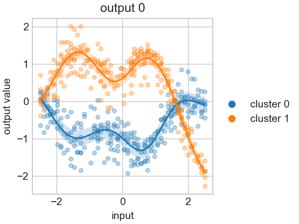
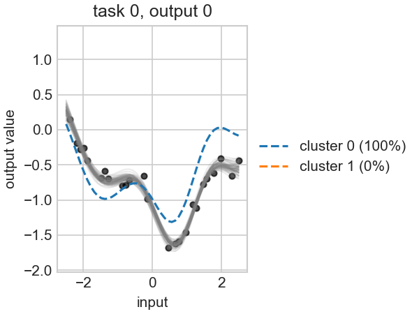

# MIMOSA: Multi-Input Multi-Output Sample Analysis 

A fully-featured *multi-task Gaussian process framework* for analysing functional data.
It is based on the [MagmaClust framework](https://jmlr.org/papers/v24/20-1321.html), with many enhancements for efficiency and modularity.

Its core features currently include:
* Joint learning across multiple samples (Multi-Task GPs) with unaligned sampling grids
* Clustering of samples
* Multi-dimensional inputs and outputs
* Probabilistic predictions with uncertainty quantification
* A multitude of training configuration to model complex relationships between tasks, clusters and inputs
* Deep kernax integration for complex kernels/means functions
* Support for training and predicting on GPUs and TPUs
* Full Jax/Equinox compatibility for vmap/grad/jit

Towards v1.0.0, we plan to add:
* Inter-output correlation learning
* Adaptation to non-gaussian data and classification tasks
* Sparse learning and approximations for scalability
* Visualisation tools for data and model outputs
* Clever initialisation for hyper-parameters of the models

> **⚠️ Project Status**:  MIMOSA is currently in early development. 
> While current features are functional in most cases, bugs can happen.
> The API and features are still subject to change.
> If you use the package for research/production, we encourage you to version-lock your mimosa dependency.

---
## Installation

You can install mimosa through pip:

```bash
pip install mimosa-ml
```

You can then import components of the package as:

```python
from mimosa.hyperpost import Hyperpost  # Import example
```

N.b.: notice the difference between `mimosa-ml` (the PyPI ID of the package) and `mimosa` (the internal package name).

Python compatibility: mimosa is compatible with Python 3.10+. 
We encourage using a more recent version to be compatible with latest releases of Jax and Equinox.

---
## Philosophy

We basically took Gaussian processes, and combined them with a ton of ✨*fancy components*✨
* ➡️ Multi-task learning based on [Magma](https://jmlr.org/papers/v24/20-1321.html)
* ➡️ Clustering as a mixture of Magma GPs
* ➡️ Multi-dimensional inputs thanks to efficient kernels from [Kernax](https://github.com/SimLej18/kernax-ml)
* ➡️ Multi-dimensional uncorrelated outputs by simply broadcasting the algorithm to another dimension
* ➡️ Multi-output correlation discovery by learning a [convolution process]([TODO]) with specific kernel


We use **JAX** as a back-end for every computation! 
`jit` compilation saves us a lot of time, 
`vmap` allows us to efficiently batch over all dimensions of the data and parameters,
`grad` spares us the hastle of implementing gradients for every component of the model, 
and XLA support allows us to train and predict on GPUs and TPUs for scalability.

A GP library is nothing without a fast and modular **Kernel library**. 
MIMOSA relies on the efficiency-focused [Kernax package](https://github.com/SimLej18/kernax-ml) for every kernel use 
throughout the algorithms.

---
## Examples

Basic examples can be found in the `examples` directory. A quick example using the top-level API from Model can be found here:

```python
import jax.random as jr
from jax import vmap
from kernax import ZeroMean, VarianceKernel, SEKernel, WhiteNoiseKernel

from mimosa.data_structures import Dimensions, Parameters, ModelConfig
from mimosa.synthetic import generate_data
from mimosa.models import BasicModel
from mimosa.grid import UnionGrid
from mimosa.plot import plot_dataset, plot_clusters, plot_single_task_prediction
from mimosa.sampling import sample_gp

key = jr.PRNGKey(0)

# 20 tasks, 2 clusters, 1D inputs/outputs, 25 points/task
dims = Dimensions(T=20, K=2, I=1, O=1, F=1, N=25, G=50)
config = ModelConfig(isotopic_tasks=False)

# Ground-truth parameters used to generate the synthetic dataset
init_params = Parameters(
	cluster_mean=ZeroMean(),
	cluster_kernel=VarianceKernel(1.0) * SEKernel(length_scale=1.0),
	task_kernel=VarianceKernel(0.1) * SEKernel(length_scale=2.0),
	noise_kernel=WhiteNoiseKernel(noise=0.01),
)

key, subkey = jr.split(key)
dataset, grid, hyperprior, mixture, parameters, cluster_means, tasks = generate_data(
	subkey, dims, init_params, config, input_range=(-2.5, 2.5))

# Fit a model on the generated dataset, starting from the same parameters
fit_grid = UnionGrid()(dataset.inputs)
model = BasicModel(jr.PRNGKey(1), n_clusters=dims.K)
fitted_params, fitted_mixture = model.fit(dataset, fit_grid, mixture.proportions, parameters, n_iter=50)

# Predict the posterior distribution of every task, in every cluster
predictions = model.predict(dataset, fit_grid, fitted_mixture, fitted_params)
hyperposterior = model.hyperpost(dataset, fit_grid, fitted_mixture, fitted_params)

# Plot the fitted mean-processes over the dataset
fig, ax = plot_dataset(dataset, mixture=mixture, alpha=.3)
fig, ax = plot_clusters(fit_grid, hyperposterior=hyperposterior, fig=fig, ax=ax, legend=False)
```



```python
# Draw samples from task 0's predictive distribution and plot them
t_id, o_id = 0, 0
k_id = int(fitted_mixture.assignments[t_id])  # task's dominant cluster
prediction = predictions[t_id, k_id, o_id]

key, sample_key = jr.split(key)
sample_keys = jr.split(sample_key, 64)
samples = vmap(lambda k: sample_gp(k, prediction.mean, prediction.covariance))(sample_keys)

fig, ax = plot_single_task_prediction(
	dataset, fit_grid, hyperposterior, fitted_mixture, t_id, o_id, samples=samples)
```



MIMOSA is designed to have multiple layer of customisation. The "Model" API covers the most general use case of the
algorithm, but you should consider building your own training loops and combining/developping your own sub-modules to 
create tailored models and pipelines.

---
## About configurations

MIMOSA has many training configurations to make it as precise as possible when modelling your specific data.
These configurations are stored in a `ModelConfig` dataclass. 
Here is a quick overview of what each configuration option does. 

* `shared_task_hps` (default `True`): whether task kernel/noise hyper-parameters are shared across all tasks, or learnt independently per task.
* `shared_cluster_hps` (default `True`): whether cluster mean/kernel hyper-parameters are shared across all clusters (mean-processes), or learnt independently per cluster.
* `shared_output_hps` (default `True`): whether hyper-parameters are shared across output dimensions, or learnt independently per output.
* `shared_features_hps` (default `True`): whether hyper-parameters are shared across features, or learnt independently per feature.
* `cluster_specific_task_hps` (default `True`): whether the task/noise kernels themselves vary depending on the cluster a task belongs to, or are shared across clusters.
* `isotopic_tasks` (default `True`): whether all tasks are observed at the same input locations, or each task has its own set of inputs.
* `isotopic_features` (default `True`): whether all features are observed at the same input locations, or each feature has its own set of inputs.

These configurations are independent of your choices of parameters (mean functions/kernels), leading to a large
number of ways to model your data.

The best way to get a feeling for which setup might be the best for your specific needs is to play
around with `generate_data` and varying configurations and parameters until you get something that looks like
your specific dataset.

---
## Troubleshooting

As with any GP-based framework, mimosa is subject to numerical stability issues.

We highly recommend to use Jax' 64bit precision:

```python
import jax
jax.config.update("jax_enable_x64", True)  # Should be called before any other jax/kernax/mimosa import
# ...other imports
```

If you still have troubles (NaN in hyperpost/likelihoods, optimisation does not converge, odd-looking mean 
processes/predictions/samples, ...), consider increasing the `jitter` used in the specific component or
directly at the Model level:

```python
model = BasicModel(prng_key=key, n_clusters=K, jitter=jnp.asarray(1e-5))
```

By default, Mimosa's jitter is fixed at 1e-8 for every component of the framework.

---
## Authors and citation

MIMOSA is primarily developed by the *Magma Task Force*, composed of:

* [Arthur Leroy](https://arthur-leroy.netlify.app/), researcher at Paris Saclay and INRAe (FR), main author of the original tool [MagmaClustR](https://arthurleroy.github.io/MagmaClustR/) and coordinator of the Task Force.
* [Simon Lejoly](https://researchportal.unamur.be/fr/persons/slejoly/), PhD student at UNamur (BE), main developper of the package and author of the [Kernax package](https://github.com/SimLej18/kernax-ml)
* [Alexia Grenouillat]([TODO]), PhD student at INSA Toulouse (FR), developper of multi-feature correlation discovery.
* [Térence Viellard]([TODO]), PhD student at INRAe (FR), working on sparse approximations and scalability.

If you use the package for your research, please consider citing the following paper:

[TODO]

If your research field could provide an interesting example of using MIMOSA, please consider publishing a toy example in
the documentation [TODO].

---
## Contributing

At this stage of development, we are not yet accepting contributions to the codebase. However, if you are interested 
in contributing to the project, please feel free to reach out to us via email or through our GitHub repository.

---
## License

This work is distributed under the [MIT License](https://opensource.org/licenses/MIT). See `LICENSE` for more information.

---


